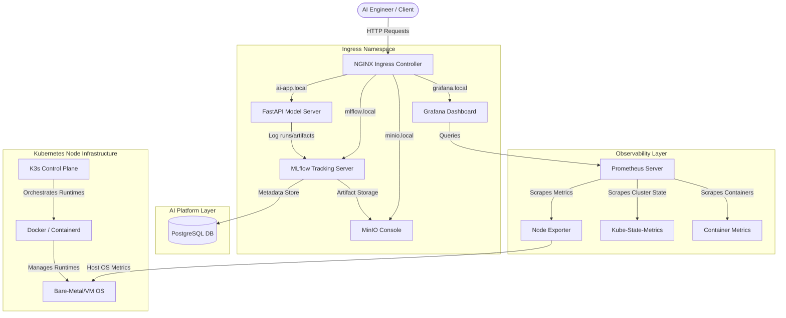

# Infrastructure Architecture & Diagram

This document details the network, port, and software component mapping of the AI Platform Infrastructure.

---

## System Topology & Flow

Below is the complete network and component interaction layout:

---

## Network & Port Map

| Component | Namespace | Internal Port | External Domain | Traffic Description |
| :--- | :--- | :--- | :--- | :--- |
| **NGINX Ingress** | `ingress-nginx` | `80` (HTTP) / `443` (HTTPS) | Host IP | Exposes HTTP routes to the external network |
| **FastAPI App** | `mlops` | `8000` | `ai-app.local` | Receives inference inputs at `/predict` |
| **MLflow Tracking** | `mlops` | `5000` | `mlflow.local` | Model run tracking UI and artifact API |
| **MinIO Storage** | `mlops` | `9000` (API) / `9001` (Console) | `minio.local` | S3 API interface and object browser console |
| **PostgreSQL** | `mlops` | `5432` | None (ClusterIP Only) | Backend store for MLflow experiments meta-records |
| **Prometheus** | `monitoring` | `9090` | None (ClusterIP Only) | Gathers and keeps time-series statistics |
| **Grafana** | `monitoring` | `80` / `3000` | `grafana.local` | Hosts metrics dashboards and user interface |

---

## Simulated GPU Topology

If GPU hardware is detected during node configuration:
1. Ansible registers the physical NVidia GPUs.
2. Registers and installs `nvidia-container-toolkit`.
3. Patches the `/etc/containerd/config.toml` runtime parameters.
4. Labels the target node with `hardware-type=gpu`.
5. Enables GPU scheduling for pods.

If GPUs are absent, the target nodes are labeled with `hardware-type=simulated-gpu`, allowing deployments to default back to CPU processing without crash-looping.
