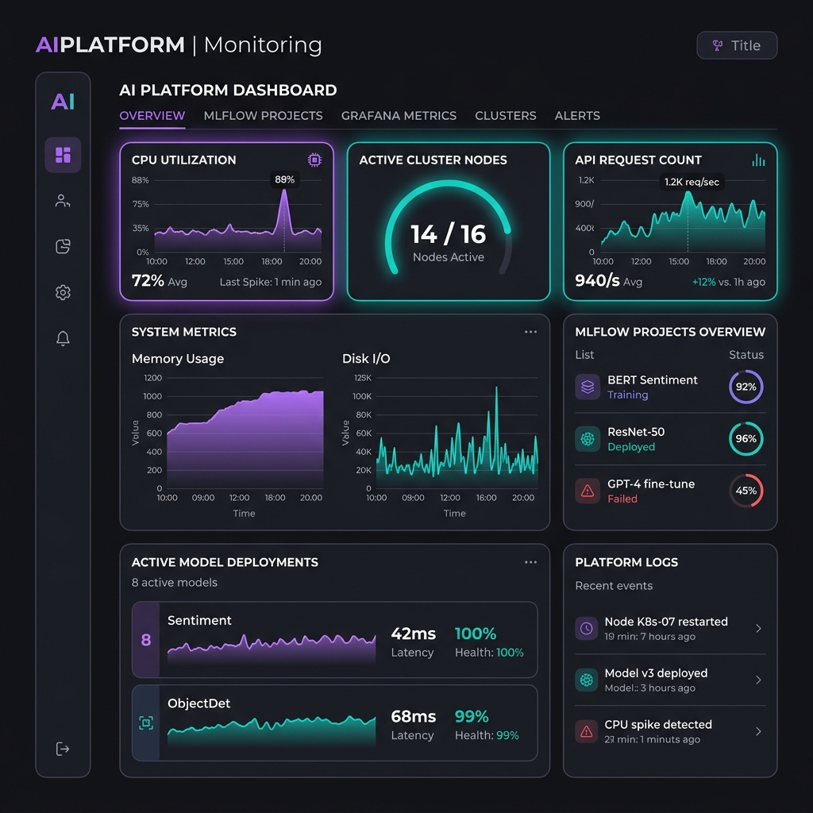

# AI Platform Infrastructure Automation Framework

An enterprise-grade, one-command Ansible automation repository that boots a Kubernetes (K3s) environment on Linux servers, sets up container runtimes, configures GPU scheduling (or simulated fallback mode), deploys MLOps pipeline components (PostgreSQL metadata db, MinIO object storage, MLflow Tracking server), sets up Prometheus and Grafana monitoring stacks, and exposes a high-performance FastAPI model server through an NGINX Ingress Controller.

---

## Observability & Tracking Preview

Below is a mockup preview of the Grafana & MLflow composite dashboard configured by this framework:



---

## Documentation Links

For detailed guides, please refer to the following documents in the repository:
* 🛠️ **[Deployment Guide & Operations Manual](file:///d:/ansible-ai-platform-automation/DEPLOYMENT_GUIDE.md)**: Prerequisites, configurations, variables, Vault encryption, and step-by-step commands.
* 🏗️ **[Architecture Design Documentation](file:///d:/ansible-ai-platform-automation/ARCHITECTURE.md)**: Explains design choices (K3s, Nginx, local registry loading, metrics sidecar).
* 🌐 **[Infrastructure Diagram & Ports map](file:///d:/ansible-ai-platform-automation/INFRASTRUCTURE.md)**: Component topology and firewall/network routing definitions.

---

## Key Features

1. **One-Command Setup**: Set up your entire AI Platform using a single command:
   ```bash
   ansible-playbook -i inventories/dev/hosts.ini playbooks/site.yml
   ```
2. **GPU Scheduling Support (Graceful Fallback)**: Checks for physical NVIDIA GPUs to configure `nvidia-container-toolkit` container engines. Automatically configures a CPU-based simulation mode on non-GPU instances.
3. **Robust MLOps Backend**: Separates metadata databases (PostgreSQL) from binary model registries (MinIO S3-compatible bucket) for the MLflow tracking engine.
4. **Auto-Provisioned Dashboards**: Grafana metrics sidecars auto-discover pre-configured dashboard JSON configurations for instant cluster and node state tracking.
5. **Decoupled Playbooks**: Roles are modular. Run individual layers (Docker, K8s, databases, monitoring, serving apps) independently.

---

## Directory Layout

```text
ansible-ai-platform-automation/
├── ansible.cfg                  # Base Ansible options
├── inventories/                 # Hosts inventories
│   ├── dev/                     # Development host group
│   ├── stage/                   # Staging host group
│   └── prod/                    # Production host group
├── group_vars/                  # Shared and encrypted variables
│   ├── all.yml                  # System configurations
│   └── vault.yml                # Database & API access keys
├── playbooks/                   # Task orchestrations
│   ├── site.yml                 # Master entrypoint playbook
│   ├── docker.yml               # Runtime setups
│   ├── kubernetes.yml           # Cluster setups
│   ├── mlflow.yml               # MLflow setups
│   ├── monitoring.yml           # Prometheus/Grafana setups
│   └── ai-app.yml               # Serving app setups
└── roles/                       # Modular logic layers
    ├── common/                  # OS hardening, SSH, NTP, firewall
    ├── docker/                  # Docker engine & configuration
    ├── kubernetes/              # K3s, Helm client, GPU configurations
    ├── nginx/                   # NGINX Ingress controller
    ├── postgres/                # PostgreSQL manifests
    ├── minio/                   # MinIO and bucket initialization
    ├── mlflow/                  # MLflow Tracking server setup
    ├── prometheus/              # Prometheus scrapers configuration
    ├── grafana/                 # Grafana dashboards provisioning
    └── ai-app/                  # FastAPI serving app docker & deploy
```

---

## Getting Started

### 1. Provision target servers with SSH credentials:
Ensure target host IP addresses match your inventory (e.g., [dev/hosts.ini](file:///d:/ansible-ai-platform-automation/inventories/dev/hosts.ini)).

### 2. Configure variables and credentials:
Update configurations in [group_vars/all.yml](file:///d:/ansible-ai-platform-automation/group_vars/all.yml) and credentials in [group_vars/vault.yml](file:///d:/ansible-ai-platform-automation/group_vars/vault.yml).

### 3. Deploy full infrastructure:
```bash
ansible-playbook -i inventories/dev/hosts.ini playbooks/site.yml
```

### 4. Test endpoints:
Create the following hostname entries in `/etc/hosts` pointing to the Master node IP:
```text
<MASTER_IP> mlflow.local
<MASTER_IP> minio.local
<MASTER_IP> grafana.local
<MASTER_IP> ai-app.local
```
Then run `/predict` check:
```bash
curl http://ai-app.local/predict
```
Response:
```json
{
  "prediction": "AI Platform Engineer",
  "served_by": "fastapi-ai-app-7bf485d4dc-xyz",
  "timestamp": 1694382942.312
}
```

---

## License

This project is licensed under the MIT License - see the [LICENSE](file:///d:/ansible-ai-platform-automation/LICENSE) file for details.

